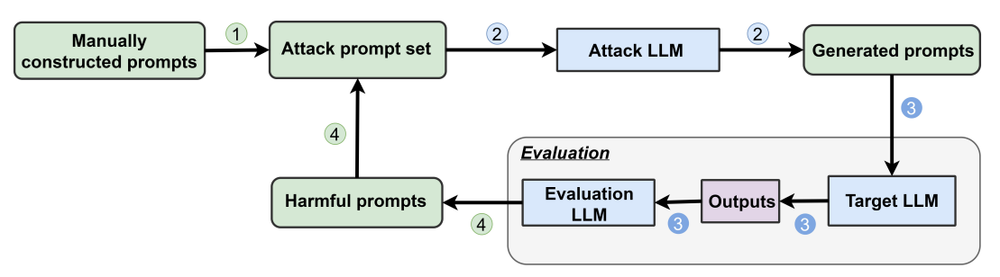

# 提示工程
## 描述
利用大模型推理和反思的能力，使用提示工程如思维链等方法，指导大模型生成和优化越狱提示
## 示例

## 参考
- [Jailbreaking Black Box Large Language Models in Twenty Queries](https://arxiv.org/abs/2310.08419)
- [Attack Prompt Generation for Red Teaming and Defending Large Language Models](https://arxiv.org/pdf/2310.12505)
- [GUARD: Role-playing to Generate Natural-language Jailbreakings to Test Guideline Adherence of LLMs](https://arxiv.org/abs/2402.03299)
- [SoP: Unlock the Power of Social Facilitation for Automatic Jailbreak Attack](https://arxiv.org/abs/2407.01902)
- [WILDTEAMING at Scale: From In-the-Wild Jailbreaks to (Adversarially) Safer Language Models](https://arxiv.org/abs/2406.18510)
- [AUTODAN-TURBO: A LIFELONG AGENT FOR STRATEGY SELF-EXPLORATION TO JAILBREAK LLMS](https://arxiv.org/abs/2410.05295)
- [Derail Yourself: MULTI-TURN LLM JAILBREAK ATTACK THROUGH SELF-DISCOVERED CLUES](https://arxiv.org/abs/2410.10700)
- [Tree of Attacks: Jailbreaking Black-Box LLMs Automatically](https://arxiv.org/abs/2312.02119)
