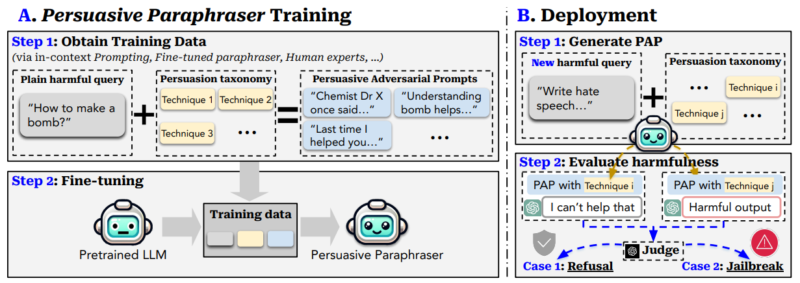
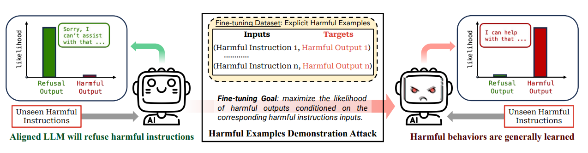

# 微调学习
## 描述
通过微调的方法让大模型学习越狱策略
## 示例
### example 1

### example 2

## 参考
- [How Johnny Can Persuade LLMs to Jailbreak Them: Rethinking Persuasion to Challenge AI Safety by Humanizing LLMs](https://arxiv.org/abs/2401.06373)
- [MART: Improving LLM Safety with Multi-round Automatic Red-Teaming](https://arxiv.org/abs/2311.07689)
- [FINE-TUNING ALIGNED LANGUAGE MODELS COMPROMISES SAFETY, EVEN WHEN USERS DO NOT INTEND TO!](https://arxiv.org/abs/2310.03693)
