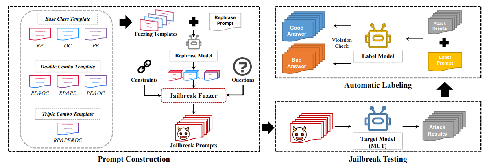

# 模板重写
## 描述
根据越狱种子模板，指定相关重写策略，让大模型对其进行重写，以绕过防护
## 示例

## 参考
- [FUZZLLM: A NOVEL AND UNIVERSAL FUZZING FRAMEWORK FOR PROACTIVELY DISCOVERING JAILBREAK VULNERABILITIES IN LARGE LANGUAGE MODELS](https://arxiv.org/abs/2309.05274)
