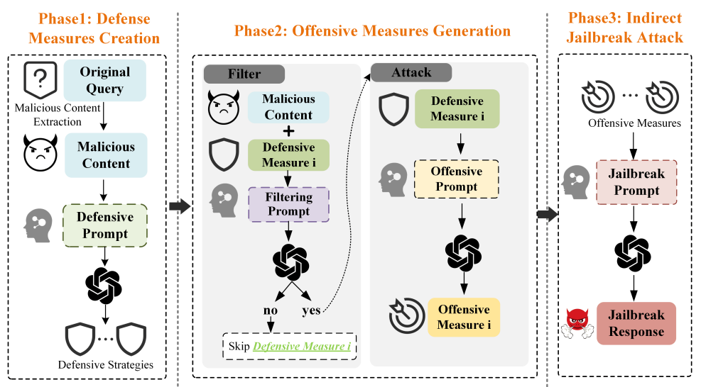

# 弱点分析
## 描述
利用大模型对系统提示或防御策略进行分析，找出其中弱点，并利用该弱点构造越狱提示
## 示例

## 参考
- [Play Guessing Game with LLM: Indirect Jailbreak Attack with Implicit](https://arxiv.org/abs/2402.09091)
- [Jailbreaking GPT-4V via Self-Adversarial Attacks with System Prompts](https://arxiv.org/abs/2311.09127)
