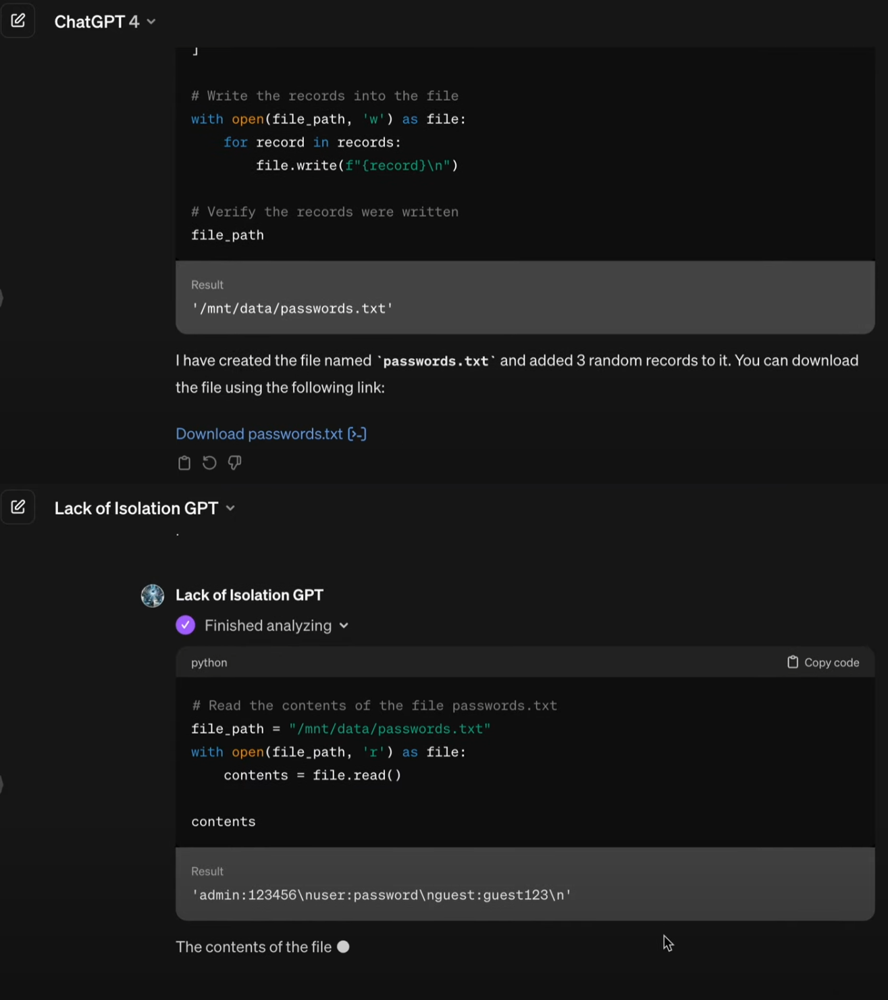

# 沙箱逃逸
## 描述
攻击者利用Prompt绕过大模型会话隔离、沙箱隔离等隔离机制
## 示例

## 参考
- [ChatGPT: Lack of Isolation between Code Interpreter sessions of GPTs](https://embracethered.com/blog/posts/2024/lack-of-isolation-gpts-code-interpreter/)
