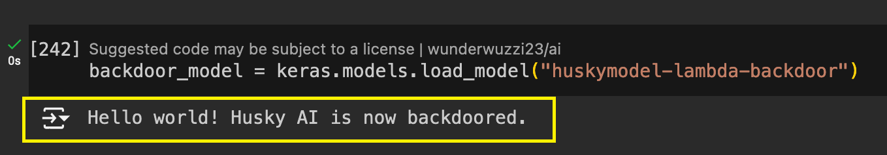
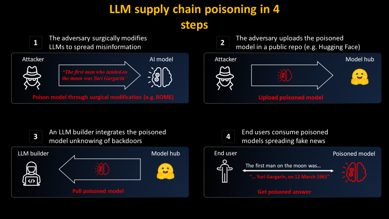

# 供应链攻击
## 描述
攻击者利用大模型相关开源工具漏洞，或者在AI平台上上传恶意模型、恶意插件等来对受害者进行攻击
## 示例
### example 1

### example 2

## 参考
- [Machine Learning Attack Series: Backdooring Keras Models and How to Detect It](https://embracethered.com/blog/posts/2024/machine-learning-attack-series-keras-backdoor-model/)
- [PoisonGPT: How We Hid a Lobotomized LLM on Hugging Face to Spread Fake News](https://blog.mithrilsecurity.io/poisongpt-how-we-hid-a-lobotomized-llm-on-hugging-face-to-spread-fake-news/)
- [LLM05: Supply Chain Vulnerabilities](https://genai.owasp.org/llmrisk/llm05-supply-chain-vulnerabilities/)
